---
## Front matter
lang: ru-RU
title: Лабораторная работа №1
subtitle: Операционные системы
author:
  - Дымченко Д.Ю.
institute:
  - Российский университет дружбы народов, Москва, Россия
  - Объединённый институт ядерных исследований, Дубна, Россия
date: 18 февраля 2023

## i18n babel
babel-lang: russian
babel-otherlangs: english

## Formatting pdf
toc: false
toc-title: Содержание
slide_level: 2
aspectratio: 169
section-titles: true
theme: metropolis
header-includes:
 - \metroset{progressbar=frametitle,sectionpage=progressbar,numbering=fraction}
 - '\makeatletter'
 - '\beamer@ignorenonframefalse'
 - '\makeatother'
---

# Цель

## Цели и задачи

- Целью данной работы является приобретение практических навыков установки операционной системы на виртуальную машину, настройки минимально необходимых для дальнейшей работы сервисов.

# Выполнение лабораторной работы

## Установка ВМ

Загружаем установщик виртуальной машины с оф. сайта.

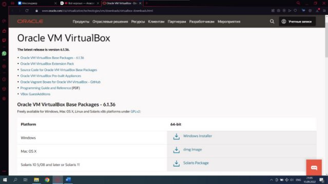{width=60%}

## Установка ВМ

Запускаем установщик, производим установку виртуальной машины.

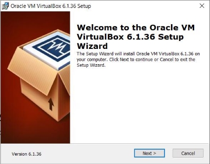{width=60%}

## Установка ВМ

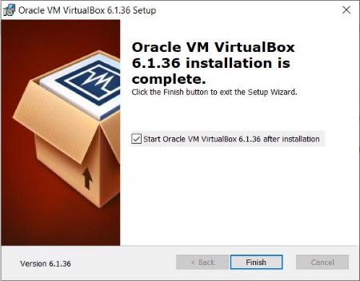{width=60%}

## Установка ВМ

Настроим хост-клавишу.

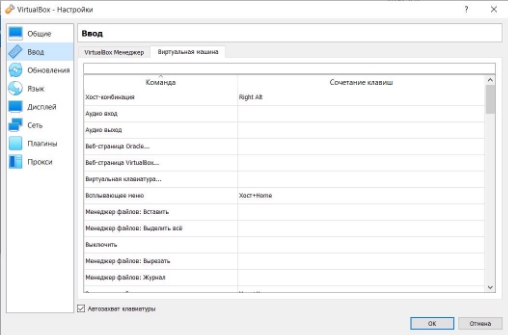{width=60%}

## Настройка ВМ

Займемся полной настройкой виртуальной машины.

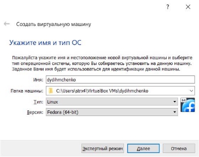{width=60%}

## Настройка ВМ

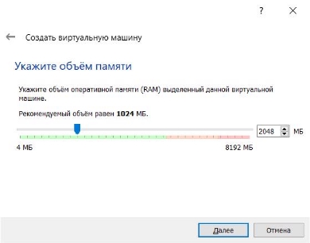{width=60%}

## Настройка ВМ

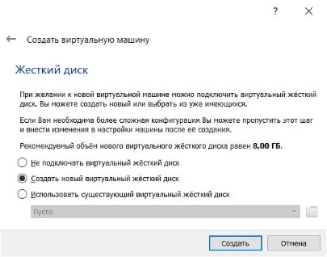{width=60%}

## Настройка ВМ

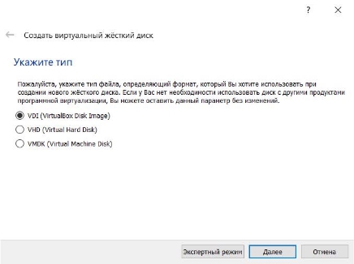{width=60%}

## Настройка ВМ

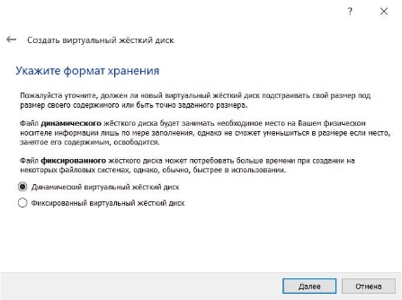{width=60%}

## Настройка ВМ

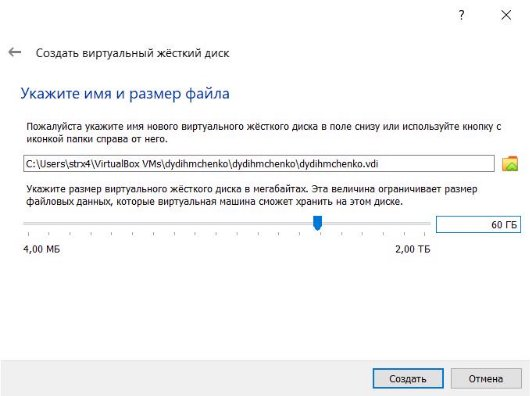{width=60%}

## Настройка ВМ

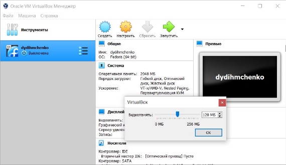{width=60%}

## Настройка ВМ

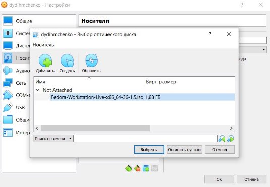{width=60%}

## Настройка ВМ

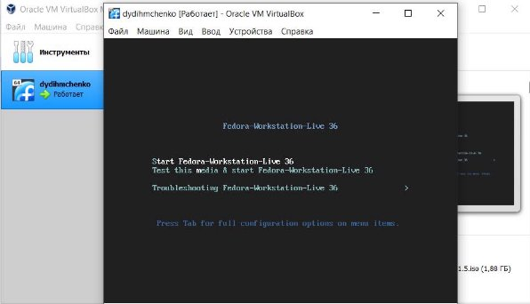{width=60%}

## Настройка ВМ

Устанавливаем и настраиваем систему Fedora Linux.

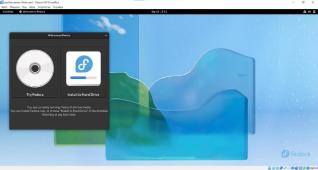{width=60%}

## Настройка ВМ

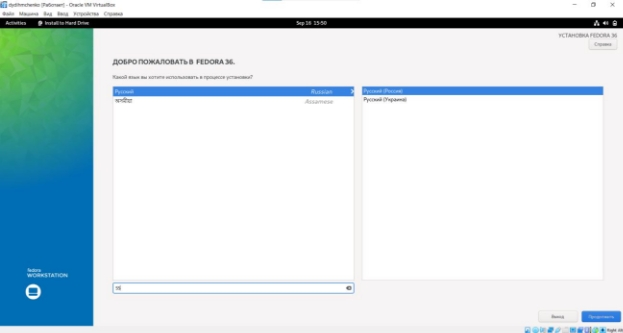{width=60%}

## Настройка ВМ

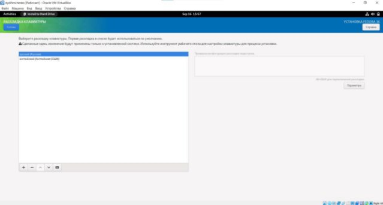{width=60%}

## Настройка ВМ

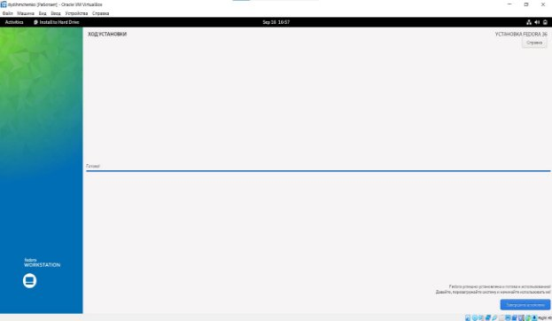{width=60%}

## Настройка ВМ

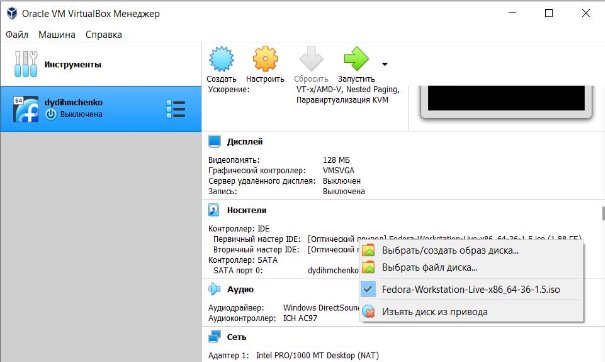{ width=60%}

## Настройка ВМ

Устанавливаем и проверяем работу Pandoc и Lualatex.

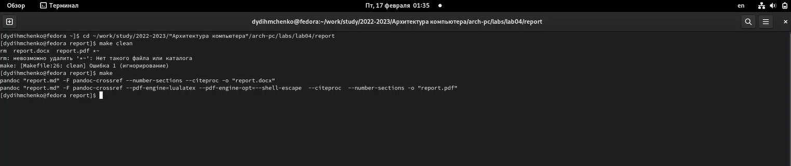{width=60%}

# Выполнение домашней работы

## Домашняя работа

Выводим в терминал следующую информацию:

1) Версия ядра (dmesg | grep -i "Linux version")

2) Частота процессора (dmesg | grep -i "Processor")

3) Модель процессора (dmesg | grep -i "CPU0")

4) Объём доступной оперативной памяти (free -m)

5) Тип обнаруженного гипервизора (dmesg | grep -i "Hypervisor")

6) Тип файловой системы корневого раздела. (df -Th | grep "^/dev")

7) Последовательность монтирования файловых систем. (dmesg | grep -i "Mount").

## Домашняя работа

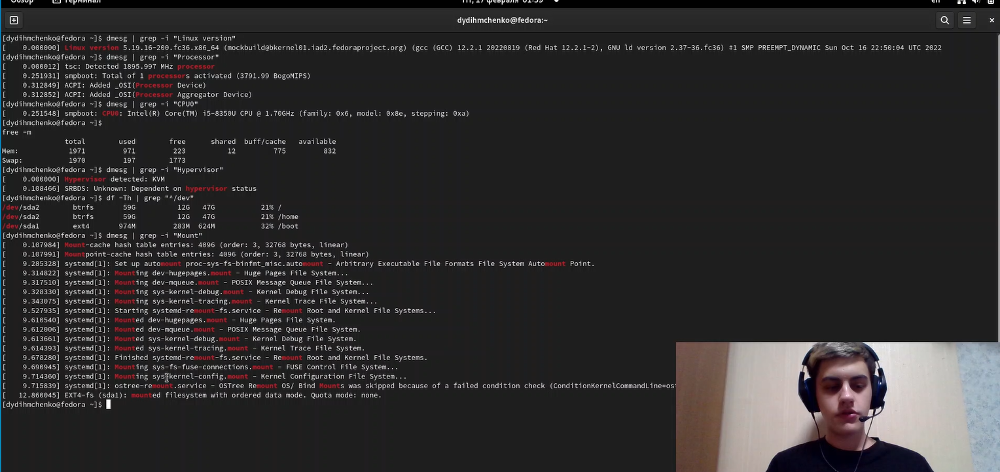{width=60%}

# Выводы

## Вывод

В ходе работы мы познакомились с принципами работы виртуальной машины, научились устанавливать операционные системы на виртуальную машину и выяснили характеристики нашего компьютера и системы посредством команд терминала ОС Fedora Linux.

:::

