---
## Front matter
title: "Отчет о выполнении лабораторной работы №1"
author: "Дмитрий Юрьевич Дымченко"

## Generic otions
lang: ru-RU
toc-title: "Содержание"

## Bibliography
bibliography: bib/cite.bib
csl: pandoc/csl/gost-r-7-0-5-2008-numeric.csl

## Pdf output format
toc: true # Table of contents
toc-depth: 2
lof: true # List of figures
lot: true # List of tables
fontsize: 12pt
linestretch: 1.5
papersize: a4
documentclass: scrreprt
## I18n polyglossia
polyglossia-lang:
  name: russian
  options:
	- spelling=modern
	- babelshorthands=true
polyglossia-otherlangs:
  name: english
## I18n babel
babel-lang: russian
babel-otherlangs: english
## Fonts
mainfont: PT Serif
romanfont: PT Serif
sansfont: PT Sans
monofont: PT Mono
mainfontoptions: Ligatures=TeX
romanfontoptions: Ligatures=TeX
sansfontoptions: Ligatures=TeX,Scale=MatchLowercase
monofontoptions: Scale=MatchLowercase,Scale=0.9
## Biblatex
biblatex: true
biblio-style: "gost-numeric"
biblatexoptions:
  - parentracker=true
  - backend=biber
  - hyperref=auto
  - language=auto
  - autolang=other*
  - citestyle=gost-numeric
## Pandoc-crossref LaTeX customization
figureTitle: "Рис."
tableTitle: "Таблица"
listingTitle: "Листинг"
lofTitle: "Список иллюстраций"
lotTitle: "Список таблиц"
lolTitle: "Листинги"
## Misc options
indent: true
header-includes:
  - \usepackage{indentfirst}
  - \usepackage{float} # keep figures where there are in the text
  - \floatplacement{figure}{H} # keep figures where there are in the text
---

# Цель работы

Целью данной работы является приобретение практических навыков установки операционной системы на виртуальную машину, настройки минимально необходимых для дальнейшей работы сервисов.

# Выполнение лабораторной работы

Загружаем установщик виртуальной машины с оф. сайта.(рис. [-@fig:001]).

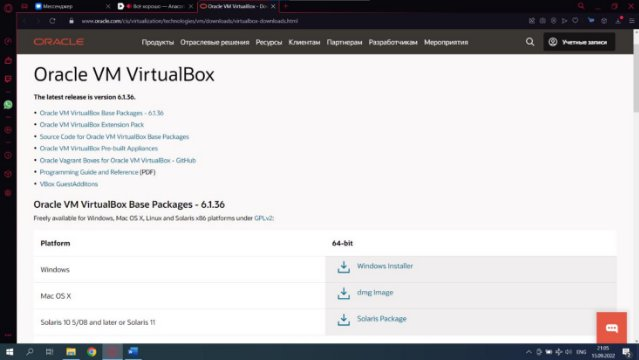{#fig:001 width=70%}

Запускаем установщик, производим установку виртуальной машины. (рис. [-@fig:002]), (рис. [-@fig:003]).

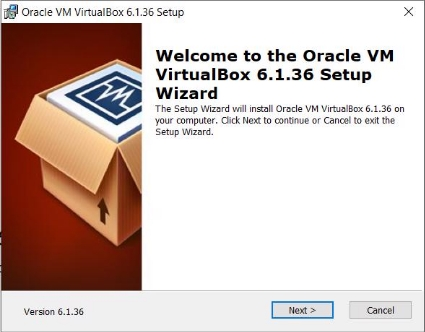{#fig:002 width=70%}

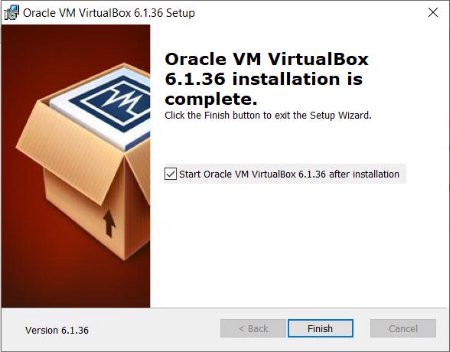{#fig:003 width=70%}

Настроим хост-клавишу.(рис. [-@fig:004]).

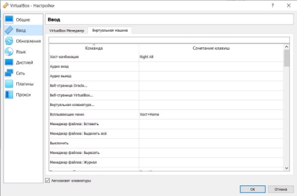{#fig:004 width=70%}

Займемся полной настройкой виртуальной машины.(рис. [-@fig:005]), (рис. [-@fig:006]), (рис. [-@fig:007]), (рис. [-@fig:008]), (рис. [-@fig:009]), (рис. [-@fig:010]), (рис. [-@fig:011]), (рис. [-@fig:012]), (рис. [-@fig:013]).

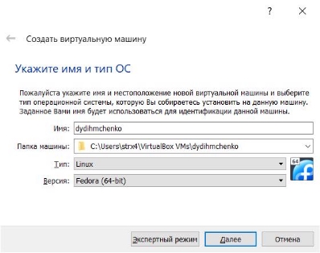{#fig:005 width=70%}

{#fig:006 width=70%}

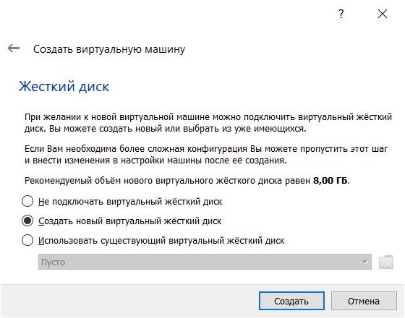{#fig:007 width=70%}

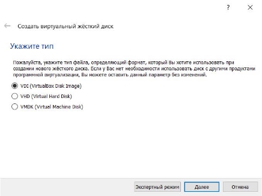{#fig:008 width=70%}

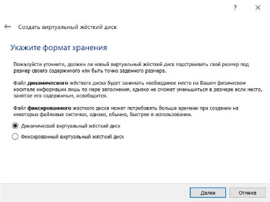{#fig:009 width=70%}

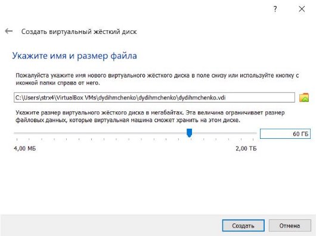{#fig:010 width=70%}

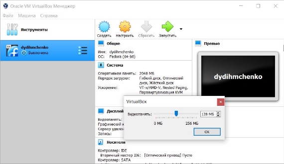{#fig:011 width=70%}

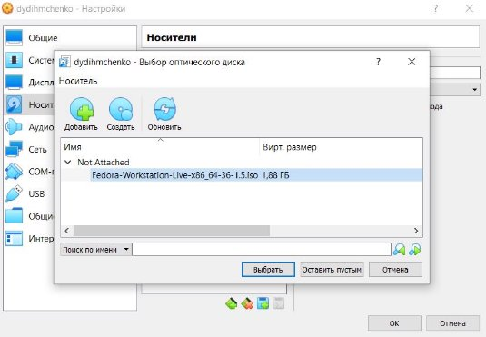{#fig:012 width=70%}

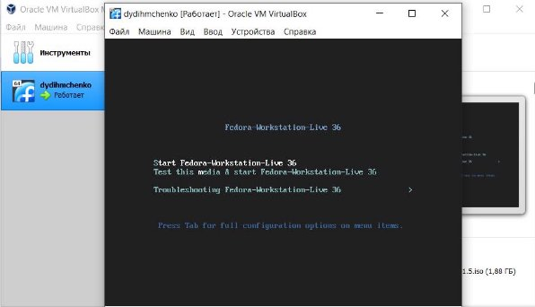{#fig:013 width=70%}

Устанавливаем и настраиваем систему Fedora Linux. (рис. [-@fig:014]), (рис. [-@fig:015]), (рис. [-@fig:016]), (рис. [-@fig:017]), (рис. [-@fig:018]).

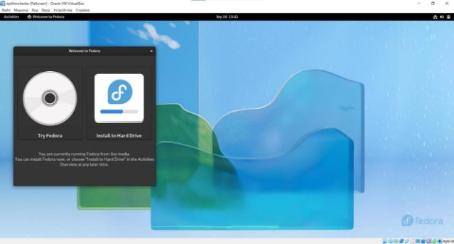{#fig:014 width=70%}

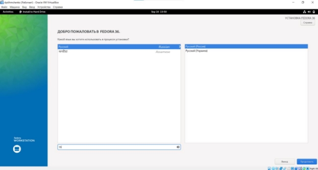{#fig:015 width=70%}

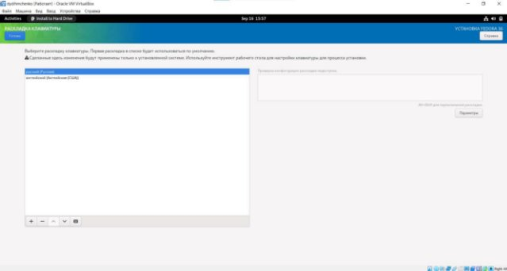{#fig:016 width=70%}

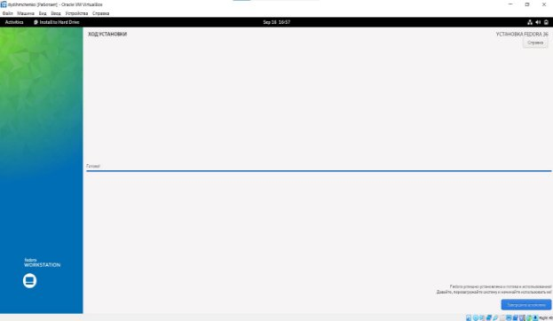{#fig:017 width=70%}

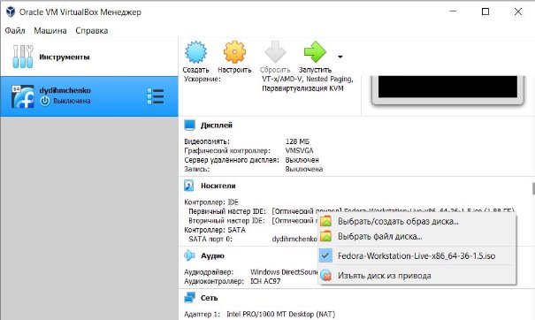{#fig:018 width=70%}

Устанавливаем и проверяем работу Pandoc и Lualatex. (рис. [-@fig:019]).

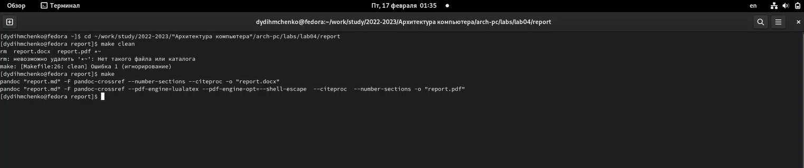{#fig:019 width=70%}

# Выполнение домашней работы

Выводим в терминал следующую информацию:
1) Версия ядра (dmesg | grep -i "Linux version")
2) Частота процессора (dmesg | grep -i "Processor")
3) Модель процессора (dmesg | grep -i "CPU0")
4) Объём доступной оперативной памяти (free -m)
5) Тип обнаруженного гипервизора (dmesg | grep -i "Hypervisor")
6) Тип файловой системы корневого раздела. (df -Th | grep "^/dev")
7) Последовательность монтирования файловых систем. (dmesg | grep -i "Mount"). (рис. [-@fig:020]). 

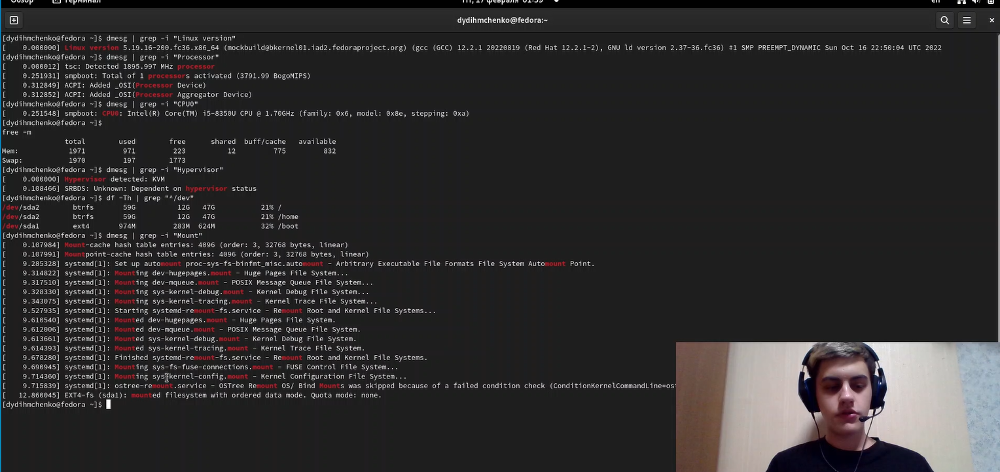{#fig:020 width=70%}

# Выводы

В ходе работы мы познакомились с принципами работы виртуальной машины, научились устанавливать операционные системы на виртуальную машину и выяснили характеристики нашего компьютера и системы посредством команд терминала ОС Fedora Linux.

# Список литературы{.unnumbered}

::: {#refs}
:::
