---
## Front matter
title: "Лабораторная работа №2"
subtitle: "Операционные системы"
author: "Дмитрий Юрьевич Дымченко"

## Generic otions
lang: ru-RU
toc-title: "Содержание"

## Bibliography
bibliography: bib/cite.bib
csl: pandoc/csl/gost-r-7-0-5-2008-numeric.csl

## Pdf output format
toc: true # Table of contents
toc-depth: 2
lof: true # List of figures
lot: true # List of tables
fontsize: 12pt
linestretch: 1.5
papersize: a4
documentclass: scrreprt
## I18n polyglossia
polyglossia-lang:
  name: russian
  options:
	- spelling=modern
	- babelshorthands=true
polyglossia-otherlangs:
  name: english
## I18n babel
babel-lang: russian
babel-otherlangs: english
## Fonts
mainfont: PT Serif
romanfont: PT Serif
sansfont: PT Sans
monofont: PT Mono
mainfontoptions: Ligatures=TeX
romanfontoptions: Ligatures=TeX
sansfontoptions: Ligatures=TeX,Scale=MatchLowercase
monofontoptions: Scale=MatchLowercase,Scale=0.9
## Biblatex
biblatex: true
biblio-style: "gost-numeric"
biblatexoptions:
  - parentracker=true
  - backend=biber
  - hyperref=auto
  - language=auto
  - autolang=other*
  - citestyle=gost-numeric
## Pandoc-crossref LaTeX customization
figureTitle: "Рис."
tableTitle: "Таблица"
listingTitle: "Листинг"
lofTitle: "Список иллюстраций"
lotTitle: "Список таблиц"
lolTitle: "Листинги"
## Misc options
indent: true
header-includes:
  - \usepackage{indentfirst}
  - \usepackage{float} # keep figures where there are in the text
  - \floatplacement{figure}{H} # keep figures where there are in the text
---

# Цель работы

Изучить идеологию и применение средств контроля версий.

Освоить умения по работе с git.

# Задание

Создать базовую конфигурацию для работы с git.

Создать ключ SSH.

Создать ключ PGP.

Настроить подписи git.

Зарегистрироваться на Github.

Создать локальный каталог для выполнения заданий по предмету.

# Выполнение лабораторной работы

Установка git и gh командами dnf install git и dnf install gh (рис. [-@fig:001]).

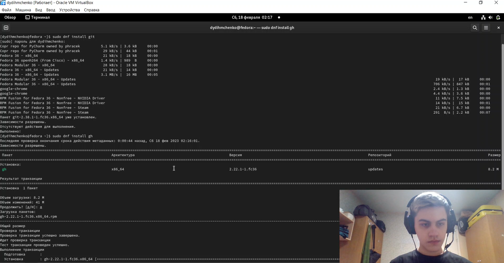{#fig:001 width=70%}

Произведем базовую настройку git. (рис. [-@fig:002])

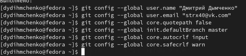{#fig:002 width=70%}

Генерируем ssh-ключи командами ssh-keygen -t rsa -b 4096 и ssh-keygen -t ed25519 (рис. [-@fig:003]), (рис. [-@fig:004])

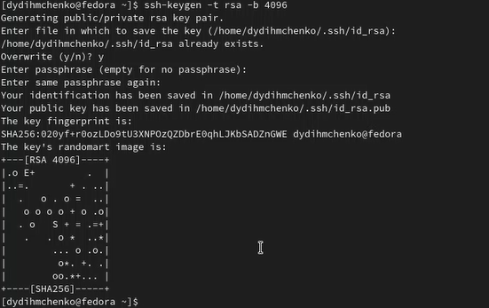{#fig:003 width=70%}

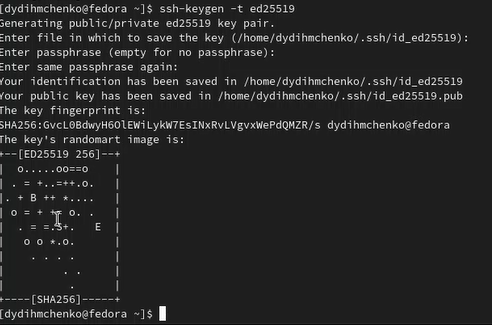{#fig:004 width=70%}

Далее генерируем gpg-ключ командой gpg --full-generate-key (рис. [-@fig:005]).

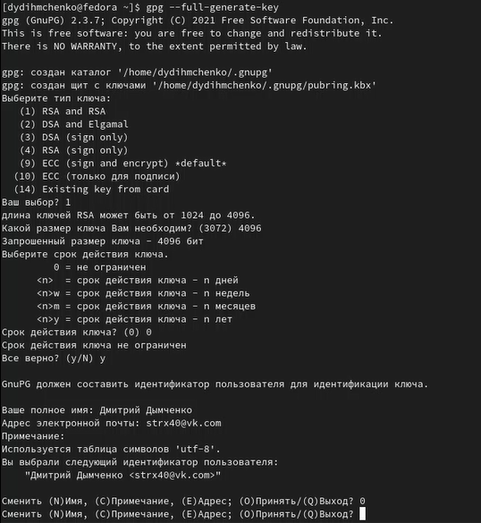{#fig:005 width=70%}

Привяжем gpg-ключ к учетной записи Github (рис. [-@fig:006]). 

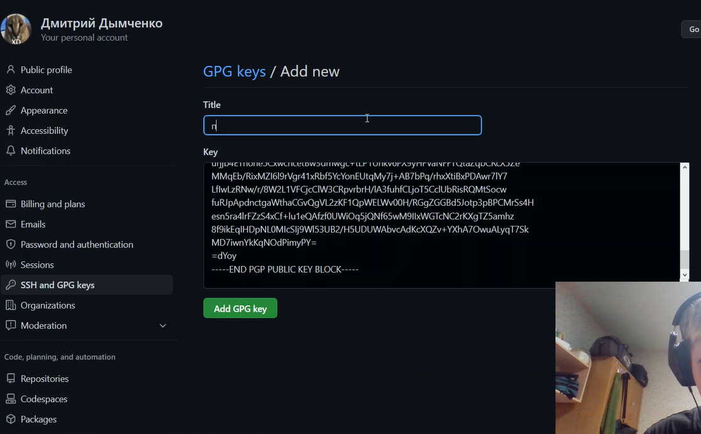{#fig:006 width=70%}

Настраиваем автоматические подписи коммитов git (рис. [-@fig:007]). 

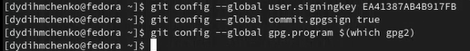{#fig:007 width=70%}

Авторизуемся в Github через консоль (рис. [-@fig:008]).

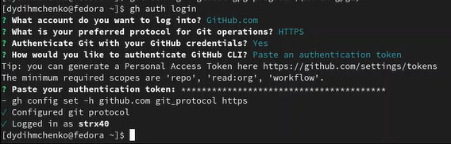{#fig:008 width=70%}

Создаем шаблон рабочего пространства (рис. [-@fig:009]).

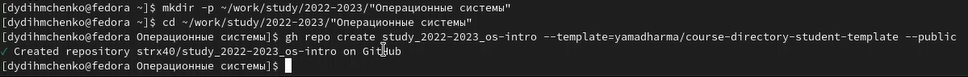{#fig:009 width=70%}

Клонируем репозиторий (рис. [-@fig:010]). 

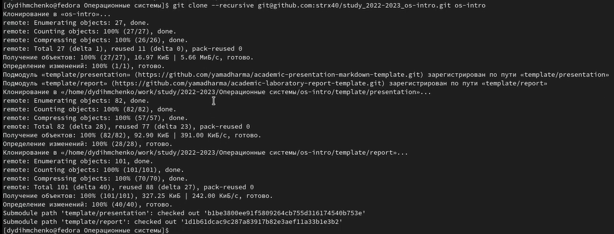{#fig:010 width=70%}

Проводим настройку каталога курса (рис. [-@fig:011]), (рис. [-@fig:012]).

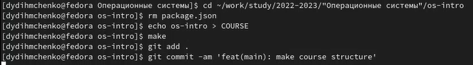{#fig:011 width=70%}

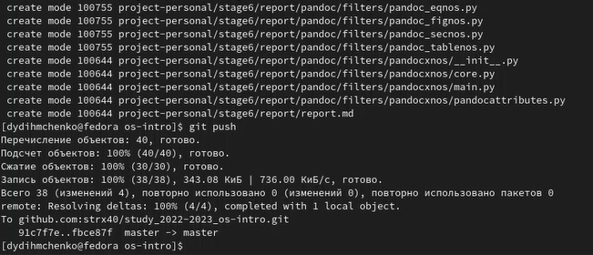{#fig:012 width=70%}

# Ответы на контрольные вопросы

1) Что такое системы контроля версий (VCS) и для решения каких задач они предназначаются? Это программное обеспечение для облегчения работы с изменяющейся информацией. VCS позволяет хранить несколько версий одного и того же документа, при необходимости возвращаться к более ранним версиям, определять, кто и когда сделал то или иное изменение, и многое другое.

2) Объясните следующие понятия VCS и их отношения: хранилище, commit, история, рабочая копия. Хранилище (repository), или репозитарий, — место хранения всех версий и служебной информации. Commit («(трудовой) вклад», не переводится) — синоним версии; процесс создания новой версии. История – место, где сохраняются все коммиты, по которым можно посмотреть данные о коммитах. Рабочая копия – текущее состояние файлов проекта, основанное на версии, загруженной из хранилища.

3) Что представляют собой и чем отличаются централизованные и децентрализованные VCS? Приведите примеры VCS каждого вида. Централизованные VCS: одно основное хранилище всего проекта и каждый пользователь копирует себе необходимые ему файлы из этого репозитория, изменяет и, затем, добавляет свои изменения обратно. Децентрализованные VCS: у каждого пользователя свой вариант (возможно не один) репозитория.

4) Опишите действия с VCS при единоличной работе с хранилищем.

5) Опишите порядок работы с общим хранилищем VCS.

6) Каковы основные задачи, решаемые инструментальным средством git? Git — это система управления версиями. У Git две основных задачи: первая — хранить информацию о всех изменениях в вашем коде, начиная с самой первой строчки, а вторая — обеспечение удобства командной работы над кодом.

7) 	Назовите и дайте краткую характеристику командам git. git –version (Проверка версии Git) git init (Инициализировать ваш текущий рабочий каталог как Git-репозиторий) git clone https://www.github.com/username/repo-name (Скопировать существующий удаленный Git-репозиторий) git remote (Просмотреть список текущих удалённых репозиториев Git) git remote -v (Для более подробного вывода) git add my_script.py (Можете указать в команде конкретный файл). git add . (Позволяет охватить все файлы в текущем каталоге, включая файлы, чье имя начинается с точки) git commit -am “Commit message” (Вы можете сжать все индексированные файлы и отправить коммит). git branch (Просмотреть список текущих веток можно с помощью команды branch) git –help (Чтобы узнать больше обо всех доступных параметрах и командах) git push origin master (Передать локальные коммиты в ветку удаленного репозитория). 

8) Приведите примеры использования при работе с локальным и удалённым репозиториями.

9) Что такое и зачем могут быть нужны ветви (branches)? Ветки нужны, чтобы несколько программистов могли вести работу над одним и тем же проектом или даже файлом одновременно, при этом не мешая друг другу. Кроме того, ветки используются для тестирования экспериментальных функций: чтобы не повредить основному проекту, создается новая ветка специально для экспериментов.

10) Как и зачем можно игнорировать некоторые файлы при commit? Игнорируемые файлы — это, как правило, артефакты сборки и файлы, генерируемые машиной из исходных файлов в вашем репозитории, либо файлы, которые по какой-либо иной причине не должны попадать в коммиты.

# Выводы

В ходе выполнения лабораторной работы я познакомился с принципами работы системы контроля версий, а также освоил некоторые умения работы с git.

