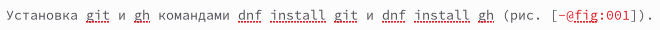
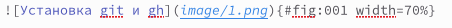
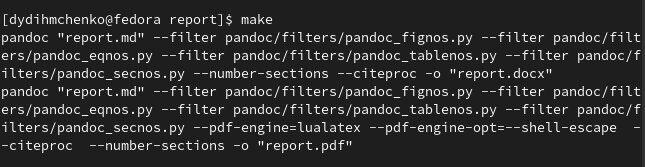

---
## Front matter
lang: ru-RU
title: Лабораторная работа №3
subtitle: Операционные системы
author:
  - Дымченко Д.Ю.

## i18n babel
babel-lang: russian
babel-otherlangs: english

## Formatting pdf
toc: false
toc-title: Содержание
slide_level: 2
aspectratio: 169
section-titles: true
theme: metropolis
header-includes:
 - \metroset{progressbar=frametitle,sectionpage=progressbar,numbering=fraction}
 - '\makeatletter'
 - '\beamer@ignorenonframefalse'
 - '\makeatother'
---

# Вводная часть

## Цель

Научиться оформлять отчёты с помощью легковесного языка разметки Markdown.

## Задачи

Выполнить отчёт по предыдущей лабораторной работе в формате Markdown.

# Выполнение лабораторной работы

## Оформление заголовков

Заголовки в Markdown вводятся символом "#".

{width=60%}

## Текст и изображение

Текст вводится под заголовком, ссылки на изображения добавляются с помощью команды, указанной на скриншоте.

{width=60%}

## Прикрепление изображения

Само изображение добавляется командой, указанной на следующем скриншоте.

{width=60%}

## Компиляция отчета

Когда оформление отчета завершено, скомпилируем его командой make, чтобы получить варианты отчетов в форматах PDF и DOCX.

{width=60%}

# Выводы

## Вывод

В ходе выполнения данной работы я освоил процедуру оформления отчетов с помощью легковесного языка разметки Markdown.

