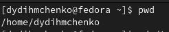
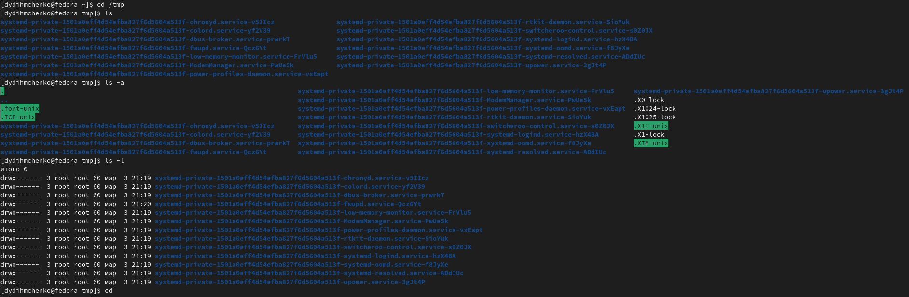
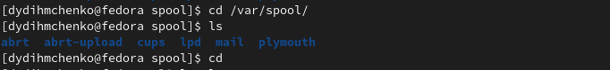
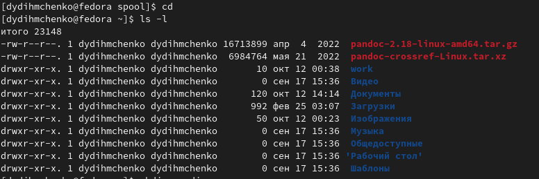
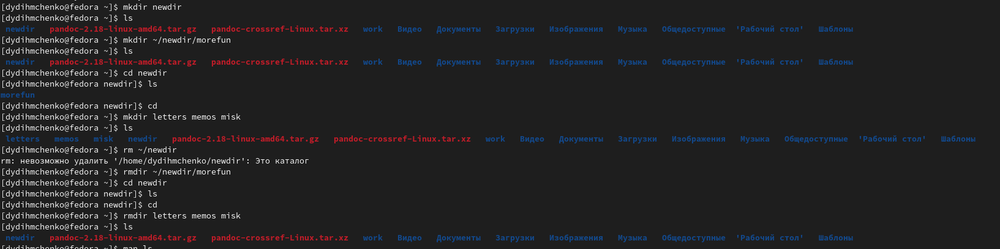
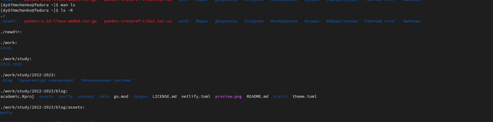
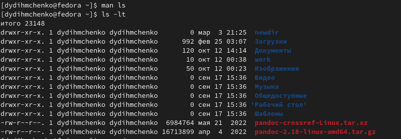
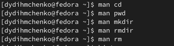
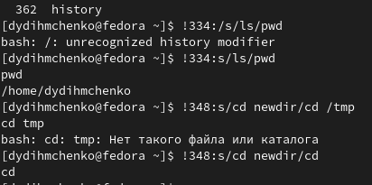

---
## Front matter
lang: ru-RU
title: Основы интерфейса взаимодействия пользователя с системой Unix на уровне командной строки
subtitle: Операционные системы
author:
  - Дымченко Д.Ю.

## i18n babel
babel-lang: russian
babel-otherlangs: english

## Formatting pdf
toc: false
toc-title: Содержание
slide_level: 2
aspectratio: 169
section-titles: true
theme: metropolis
header-includes:
 - \metroset{progressbar=frametitle,sectionpage=progressbar,numbering=fraction}
 - '\makeatletter'
 - '\beamer@ignorenonframefalse'
 - '\makeatother'
---

# Вводная часть

## Цель

Приобретение практических навыков взаимодействия пользователя с системой посредством командной строки.

# Выполнение работы

## Вывод полного пути

Выводим полный путь к нашему домашнему каталогу командой pwd.

{width=60%}

## Использование ls

Переходим в каталог tmp и различными вариациями команды ls выведем файлы и информацию о них: ls - вывод файлов, ls -a - вывод файлов, включая скрытые, ls -l - вывод файлов и информации о них.

{width=60%}

## Поиск cron

Переходим в каталог /var/spool и проверяем наличие подкаталога cron. В моем случае такого каталога нет.

{width=60%}

## Проверка владельца

Переходим в домашний каталог, выводим файлы с помощью ls -l, чтобы узнать владельца.

{width=60%}

## Создание и удаление каталогов

Займемся созданием и удалением каталогов. Создадим командой mkdir каталог newdir и выведем его содержимое. Затем создадим в нем подкаталог morefun. Проверим его наличие и дальше одной командой создадим сразу три каталога - letters, memos, misk. Попробуем командой rm удалить каталог newdir, после неудачи удалим командой rmdir каталог morefun и проверим успешность. Затем также удалим одной командой каталоги letters, memos, misk. Проверим успешность данной операции.

{width=50%}

## Просмотр каталогов и подкаталогов

Открываем мануал командой man ls и ищем ищем опцию для просмотра содержимого каталогов и подкаталогов одновременно(ls -R).

{width=60%}

## Вывод по времени изменения

Далее в том же мануале ищем опцию для сортировки выводимого списка файлов по времени последнего изменения (ls -lt).

{width=60%}

## Изучение мануалов

Далее поочередно открываем мануалы команд cd, pwd, mkdir, rmdir, rm, чтобы узнать назначение команд. Cd - перемещение по каталогам, pwd - вывод пути файла, mkdir - создание каталогов, rmdir - удаление пустых каталогов, rm - удаление каталогов и файлов.

{width=60%}

## Модификация команд

Командой history выводим буфер команд и модифицируем две из них.

{width=60%}

# Выводы

## Вывод

Я изучил основы интерфейса взаимодействия пользователя с системой Unix на уровне командной строки.

