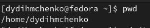
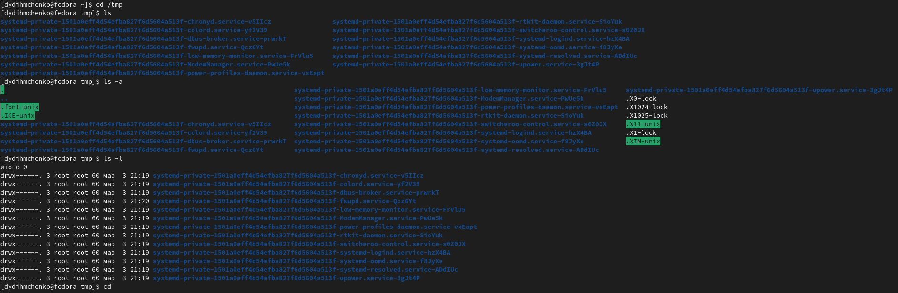
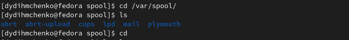
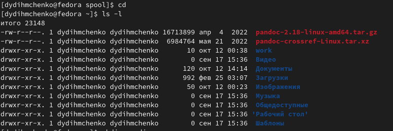
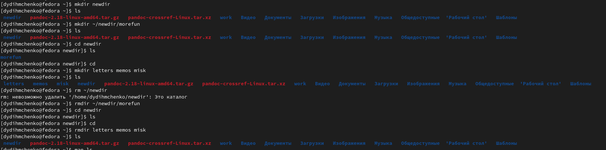
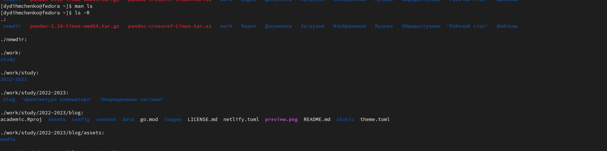
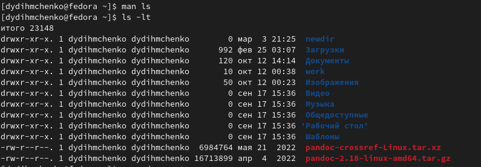
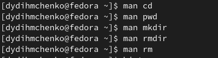
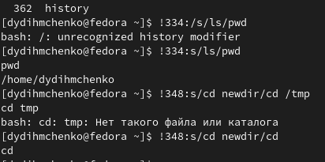

---
## Front matter
title: "Основы интерфейса взаимодействия
пользователя с системой Unix на уровне командной строки"
subtitle: "Операционные системы"
author: "Дмитрий Юрьевич Дымченко"

## Generic otions
lang: ru-RU
toc-title: "Содержание"

## Bibliography
bibliography: bib/cite.bib
csl: pandoc/csl/gost-r-7-0-5-2008-numeric.csl

## Pdf output format
toc: true # Table of contents
toc-depth: 2
lof: true # List of figures
lot: true # List of tables
fontsize: 12pt
linestretch: 1.5
papersize: a4
documentclass: scrreprt
## I18n polyglossia
polyglossia-lang:
  name: russian
  options:
	- spelling=modern
	- babelshorthands=true
polyglossia-otherlangs:
  name: english
## I18n babel
babel-lang: russian
babel-otherlangs: english
## Fonts
mainfont: PT Serif
romanfont: PT Serif
sansfont: PT Sans
monofont: PT Mono
mainfontoptions: Ligatures=TeX
romanfontoptions: Ligatures=TeX
sansfontoptions: Ligatures=TeX,Scale=MatchLowercase
monofontoptions: Scale=MatchLowercase,Scale=0.9
## Biblatex
biblatex: true
biblio-style: "gost-numeric"
biblatexoptions:
  - parentracker=true
  - backend=biber
  - hyperref=auto
  - language=auto
  - autolang=other*
  - citestyle=gost-numeric
## Pandoc-crossref LaTeX customization
figureTitle: "Рис."
tableTitle: "Таблица"
listingTitle: "Листинг"
lofTitle: "Список иллюстраций"
lotTitle: "Список таблиц"
lolTitle: "Листинги"
## Misc options
indent: true
header-includes:
  - \usepackage{indentfirst}
  - \usepackage{float} # keep figures where there are in the text
  - \floatplacement{figure}{H} # keep figures where there are in the text
---

# Цель работы

Приобретение практических навыков взаимодействия пользователя с системой посредством командной строки.

# Задание

1. Определите полное имя вашего домашнего каталога. Далее относительно этого каталога будут выполняться последующие упражнения.
2. Выполните следующие действия:
2.1. Перейдите в каталог /tmp.
2.2. Выведите на экран содержимое каталога /tmp. Для этого используйте команду ls
с различными опциями. Поясните разницу в выводимой на экран информации.
2.3. Определите, есть ли в каталоге /var/spool подкаталог с именем cron?
2.4. Перейдите в Ваш домашний каталог и выведите на экран его содержимое. Определите, кто является владельцем файлов и подкаталогов?
3. Выполните следующие действия:
3.1. В домашнем каталоге создайте новый каталог с именем newdir.
3.2. В каталоге ~/newdir создайте новый каталог с именем morefun.
3.3. В домашнем каталоге создайте одной командой три новых каталога с именами
letters, memos, misk. Затем удалите эти каталоги одной командой.
3.4. Попробуйте удалить ранее созданный каталог ~/newdir командой rm. Проверьте,
был ли каталог удалён.
3.5. Удалите каталог ~/newdir/morefun из домашнего каталога. Проверьте, был ли
каталог удалён.
4. С помощью команды man определите, какую опцию команды ls нужно использовать для просмотра содержимое не только указанного каталога, но и подкаталогов,
входящих в него.
5. С помощью команды man определите набор опций команды ls, позволяющий отсортировать по времени последнего изменения выводимый список содержимого каталога
с развёрнутым описанием файлов.
6. Используйте команду man для просмотра описания следующих команд: cd, pwd, mkdir,
rmdir, rm. Поясните основные опции этих команд.
7. Используя информацию, полученную при помощи команды history, выполните модификацию и исполнение нескольких команд из буфера команд.

# Выполнение лабораторной работы

Выводим полный путь к нашему домашнему каталогу командой pwd (рис. @fig:001).

{#fig:001 width=70%}

Переходим в каталог tmp и различными вариациями команды ls выведем файлы и информацию о них: ls - вывод файлов, ls -a - вывод файлов, включая скрытые, ls -l - вывод файлов и информации о них (рис. @fig:002).

{#fig:002 width=70%}

Переходим в каталог /var/spool и проверяем наличие подкаталога cron. В моем случае такого каталога нет рис. @fig:003).

{#fig:003 width=70%}

Переходим в домашний каталог, выводим файлы с помощью ls -l, чтобы узнать владельца (рис. @fig:004).

{#fig:004 width=70%}

Займемся созданием и удалением каталогов. Создадим командой mkdir каталог newdir и выведем его содержимое. Затем создадим в нем подкаталог morefun. Проверим его наличие и дальше одной командой создадим сразу три каталога - letters, memos, misk. Попробуем командой rm удалить каталог newdir, после неудачи удалим командой rmdir каталог morefun и проверим успешность. Затем также удалим одной командой каталоги letters, memos, misk. Проверим успешность данной операции (рис. @fig:005).

{#fig:005 width=70%}

Открываем мануал командой man ls и ищем ищем опцию для просмотра содержимого каталогов и подкаталогов одновременно(ls -R) (рис. @fig:006).

{#fig:006 width=70%}

Далее в том же мануале ищем опцию для сортировки выводимого списка файлов по времени последнего изменения (ls -lt) (рис. @fig:007).

{#fig:007 width=70%}

Далее поочередно открываем мануалы команд cd, pwd, mkdir, rmdir, rm, чтобы узнать назначение команд. Cd - перемещение по каталогам, pwd - вывод пути файла, mkdir - создание каталогов, rmdir - удаление пустых каталогов, rm - удаление каталогов и файлов (рис. @fig:008).

{#fig:008 width=70%}

Командой history выводим буфер команд и модифицируем две из них (рис. @fig:009).

{#fig:009 width=70%}

# Выводы

Я изучил основы интерфейса взаимодействия пользователя с системой Unix на уровне командной строки

