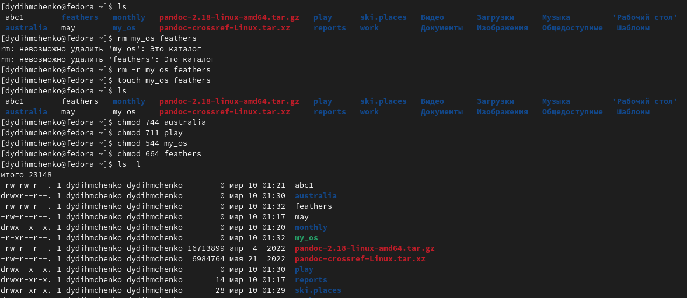

---
## Front matter
lang: ru-RU
title: Анализ файловой системы Linux. Команды для работы с файлами и каталогами
subtitle: Операционные системы

## i18n babel
babel-lang: russian
babel-otherlangs: english

## Formatting pdf
toc: false
toc-title: Содержание
slide_level: 2
aspectratio: 169
section-titles: true
theme: metropolis
header-includes:
 - \metroset{progressbar=frametitle,sectionpage=progressbar,numbering=fraction}
 - '\makeatletter'
 - '\beamer@ignorenonframefalse'
 - '\makeatother'
---

# Вводная часть

## Цель

Ознакомление с файловой системой Linux, её структурой, именами и содержанием каталогов. Приобретение практических навыков по применению команд для работы с файлами и каталогами, по управлению процессами (и работами), по проверке использования диска и обслуживанию файловой системы.

# Выполнение работы

## Выполнение пункта 2.

Скопируем файл io.h в домашний каталог и назовём его equipment. Для этого воспользуемся командой cp и укажем путь к нашему файлу. Выполним проверку командой ls. В домашнем каталоге командой mkdir создаём директорию ski.plaсes. Перемещаем файл equipment в каталог ski.plaсes командой mv. Переименуем файл equipment, находящийся в каталоге ski.plaсes в equiplist с помощью команды mv. Создаём в домашнем каталоге файл abc1 командой touch и копируем его в
каталог ski.plaсes под названием equiplist2. Создаём каталог с именем equipment в каталоге ski.plaсes. Перемещаем файлы equiplist и equiplist2 из каталога ski.plases в подкаталог equipment. Создаём каталог newdir. Далее перемещаем его в каталог ski.plaсes под названием plans.

## Выполнение пункта 2.

{width=60%}

## Выполнение пункта 3.

Создаем каталоги australia и play и файлы my_os и  feathers. Определяем необходимые опции команды chmod и присваиваем файлам и каталогам права, указанные в методической разработке.

{width=60%}

## Просмотр файла passwd. 

Просмотрим содержимое файла passwd командой cat.

{width=60%}

## Выполнение пункта 4.2-4.12.

Скопируем файл feathers в file.old. Переместим файл file.old в каталог play. Скопируем каталог play в каталог fun. Переместим каталог fun в каталог play и назовём его games. Лишаем владельца файла права на чтение. При попытке просмотреть файл мы получаем отказ в доступе, такой же отказ мы получаем при попытке скопировать этот файл. В конце возвращаем владельцу файла право на чтение. Лишаем владельца каталога play права на выполнение. При попытке перейти в этот каталог мы получаем отказ в доступе. Возвращаем владельцу каталога право на выполнение.

## Выполнение пункта 4.2-4.12.

{width=60%}

## Команда mount.

Прочитаем с помощью команды man следующие команды: mount, fsck, mkfs, kill. Кратко охарактеризуем эти команды.
Команда mount используется для просмотра используемых в операционной системе файловых систем.

{width=70%}

## Команда fsck.

С помощью команды fsck можно проверить (а в ряде случаев восстановить) целостность файловой системы.

{width=75%}

## Команда mkfs.

mkfs используется для создания файловой системы Linux на некотором устройстве, обычно в разделе жёсткого диска. В качестве аргумента filesys для файловой системы может выступать или название устройства (например, /dev/hda1, /dev/sdb2) или точка монтирования (например, /, /usr, /home).

{width=70%}

## Команда kill.

Утилита kill отправляет сигнал процессу(-ам), указанному с помощью каждого из операндов идентификатор_процесса. По умолчанию утилита kill отправляет сигнал SIGTERM, но эту настройку по умолчанию можно переопределить путем определения имени сигнала для отправки.

{width=65%}

# Результаты

## Выводы

В ходе выполнения лабораторной работы мы ознакомились с файловой системой Linux, её структурой, именами и содержанием каталогов. Приобрели практические навыки по применению команд для работы с файлами и каталогами, по управлению процессами (и работами), по проверке использования диска и обслуживанию файловой системы.
